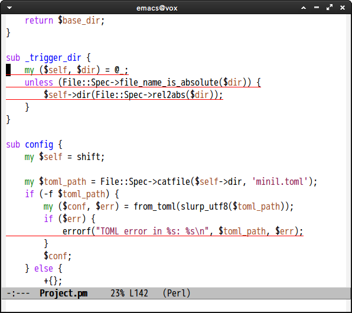

# devel-cover

Highlight coverage C0 lines by html generated by [Devel::Cover](https://metacpan.org/module/Devel::Cover)


## Screenshot




## Example

```
 % cd SomeProject/
 % ./Build testcover
 % emacsclient -n lib/Foo/Bar.pm
```

From Emacs
```
 M-x devel-cover-highlight-c0-lines
```


## Commands

#### `devel-cover-highlight-c0-lines`

Highlights C0 lines. This command searches `cover_db` directory and
selects coverage HTML of this file. Please input database directory,
if it cannot find db directory,

#### `devel-cover-unhighlight`

Un-highlight C0 lines

#### `devel-cover-unhighlight-region`

Un-highlight specified region


## faces

#### `devel-cover-c0-line`

face of c0 line
